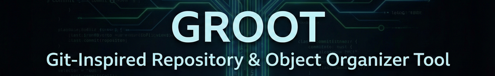
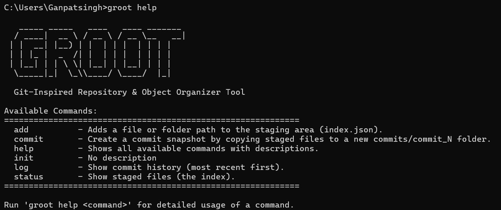
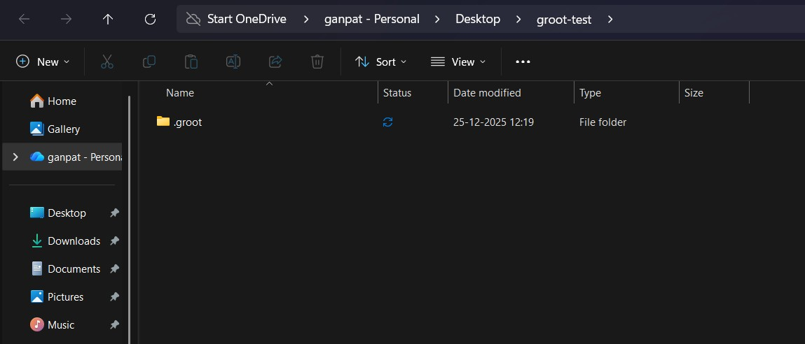
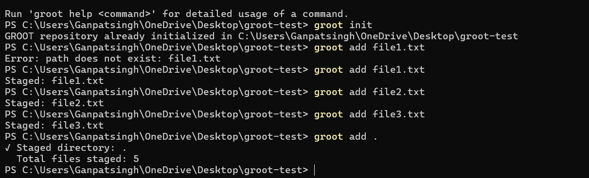
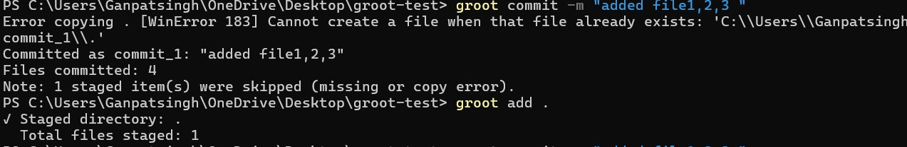
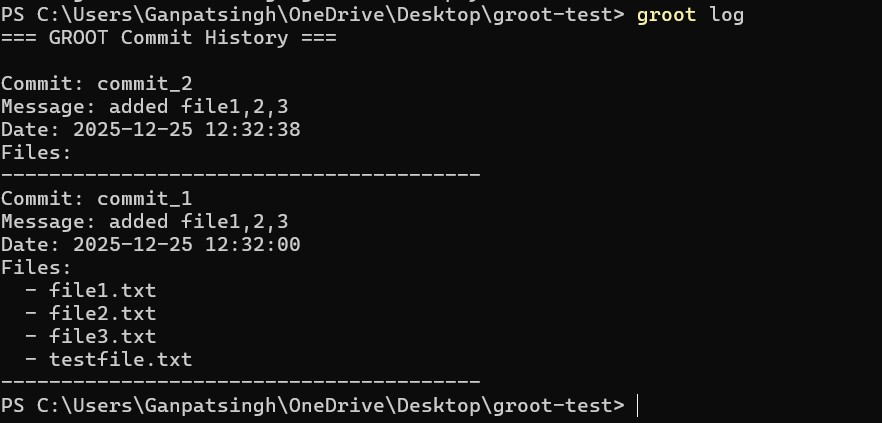
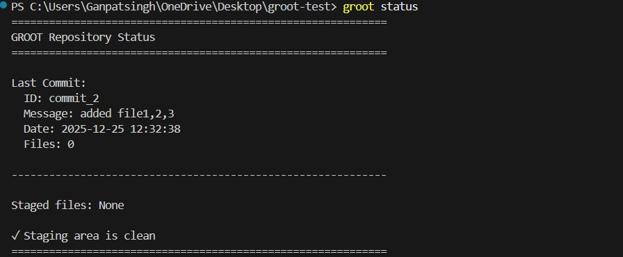
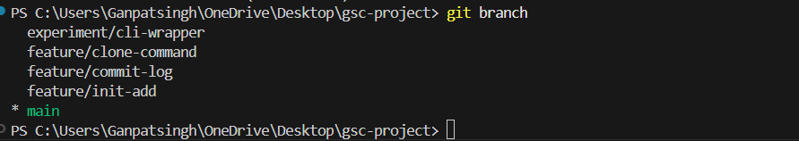
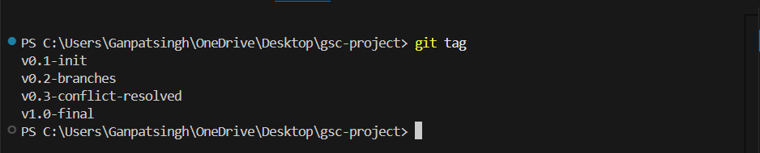

<div align="center">

#  GROOT  
## Git-Inspired Repository & Object Organizer Tool

[](https://www.python.org/)
[](https://www.microsoft.com/windows)
[](#)
[](#)

**A beginner-friendly, command-line based version control system developed for educational purposes.**

GROOT demonstrates the internal working of version control systems by implementing core concepts such as repository initialization, staging, committing, branching, and merging.



</div>

---

## 📋 Table of Contents

- [Project Objectives](#-project-objectives)
- [Technologies Used](#️-technologies-used)
- [Project Structure](#-project-structure)
- [Installation & Setup](#-installation--setup)
- [Commands and Usage](#-commands-and-usage)
- [Branching and Merging](#-branching-and-merging)
- [Version Tags](#️-version-tags)
- [GitHub Integration](#-github-integration)
- [Learning Outcomes](#-learning-outcomes)
- [Future Scope](#-future-scope)
- [References](#-references)

---

## 📌 Project Objectives

This project was developed as part of the **INT 331 – Fundamentals Of Devops** course with the following objectives:

- ✅ Understand the internal working of version control systems  
- ✅ Implement core VCS concepts using Python  
- ✅ Demonstrate branching and merging  
- ✅ Use Git Bash and GitHub for real project versioning  
- ✅ Develop comprehensive documentation following academic standards  

Unlike industrial tools such as Git, GROOT focuses on **educational clarity**, enabling learners to understand how version control systems work internally.

---

## 🛠️ Technologies Used

| Category | Technology |
|----------|-----------|
| **Programming Language** | Python 3.x |
| **Version Control** | Git, GitHub |
| **Interface** | Command Line (CMD / PowerShell / Git Bash) |
| **Platform** | Windows |
| **Development Tools** | VS Code, Git Bash |

---

## 📂 Project Structure

```
gsc-project/
│
├── main.py                      # Entry point for GROOT CLI
├── README.md                    # Project documentation
├── usage.md                     # Detailed usage guide
│
├── bin/
│   └── groot.bat               # Windows batch script for global CLI access
│
├── commands/                    # Command implementations
│   ├── __init__.py             # Package initialization
│   ├── init.py                 # Repository initialization
│   ├── add.py                  # File staging
│   ├── commit.py               # Commit creation
│   ├── log.py                  # Commit history
│   ├── status.py               # Repository status
│   └── help.py                 # Help command
│
├── docs/                        # Documentation
│   ├── INSTALL_WINDOWS.md      # Windows installation guide
│   └── screenshots/            # Project screenshots
│
├── examples/                    # Example files for testing
│   └── sample.txt              
│
└── tests/                       # Test scripts and demos
    ├── init_add_demo.cmd       # Demo: init and add commands
    ├── commit_log_demo.cmd     # Demo: commit and log commands
    └── tests_commands.md       # Test documentation
```

---

## 🚀 Installation & Setup

### Prerequisites

- **Python 3.x** installed and added to PATH
- **Git Bash** (optional, for Git operations)
- **Windows OS** (tested on Windows 10/11)

### Installation Steps

1. **Clone or download the project**
   ```bash
   git clone https://github.com/yourusername/gsc-project.git
   cd gsc-project
   ```

2. **Set up the global CLI**
   - Copy the `bin/groot.bat` file to a folder in your system PATH, or
   - Add the `bin/` directory to your system PATH

3. **Verify installation**
   ```bash
   groot --help
   ```


> *Screenshot : Terminal showing successful `groot --help` output*

For detailed installation instructions, see [INSTALL_WINDOWS.md](docs/INSTALL_WINDOWS.md).

---

## 🧪 Commands and Usage

### 1. Initialize Repository

```bash
groot init
```

Creates a `.groot/` directory in the current folder to initialize version control.


> *Screenshot : Output of `groot init` showing directory creation*

---

### 2. Stage Files

```bash
groot add <file_name>
groot add <folder_name>
groot add .
```

Adds files or folders to the staging area.

**Example:**
```bash
groot add example.txt
groot add examples/
```


> *Screenshot : Output of `groot add` showing files staged*

---

### 3. Commit Changes

```bash
groot commit -m "your commit message"
```

Creates a snapshot of staged files and stores it in commit history.

**Example:**
```bash
groot commit -m "Initial commit with example files"
```


> *Screenshot : Output of `groot commit` showing successful commit*

---

### 4. View Commit History

```bash
groot log
```

Displays the list of all commits with timestamps and messages.


> *Screenshot : Output of `groot log` showing commit history*

---

### 5. Check Repository Status

```bash
groot status
```

Shows currently staged files and repository state.


> *Screenshot : Output of `groot status` showing staged files*

---

## 🌿 Branching and Merging

The project demonstrates Git branching workflows through multiple feature branches:

- `feature/init-add` – Init and Add commands implementation
- `feature/commit-log` – Commit and Log commands implementation

**Branch Creation and Merging Example:**

```bash
git checkout -b feature/init-add
# ... work on feature ...
git add .
git commit -m "Implement init and add commands"
git checkout main
git merge feature/init-add
```


> *Screenshot placeholder: `git branch` output showing multiple branches*


> *Screenshot placeholder: Terminal showing successful merge output*

---

## ️ Version Tags

Git tags were used to mark major project milestones:

| Tag | Description |
|-----|-------------|
| `v0.1-init` | Initial working version with basic commands |
| `v0.2-branches` | All feature branches merged |
| `v1.0-final` | Final submission-ready version |

**Create and Push Tags:**
```bash
git tag v1.0-final
git push origin --tags
```


> *Screenshot placeholder: Output of `git tag` showing all tags*

---

## 🔗 GitHub Integration

The project is fully integrated with GitHub:

- ✅ Remote repository connected using `git remote`
- ✅ All branches pushed to GitHub
- ✅ Tags pushed and visible on GitHub releases
- ✅ Complete version history maintained

**Commands Used:**
```bash
git remote add origin https://github.com/yourusername/gsc-project.git
git push -u origin main
git push origin --all
git push origin --tags
```

---

## 🧠 Learning Outcomes

Through the development of GROOT, the following competencies were achieved:

1. **Conceptual Understanding**
   - Deep understanding of repository, staging area, and commit concepts
   - Knowledge of how version control systems store and track changes

2. **Practical Skills**
   - Hands-on experience with branching and merging workflows
   - Experience in building a CLI tool with Python

3. **Professional Development**
   - Improved Git and GitHub proficiency
   - Documentation and project organization skills
   - Academic research and citation practices

4. **Problem Solving**
   - Debugging and error handling in CLI applications
   - Designing user-friendly command-line interfaces
   - Understanding cross-platform compatibility challenges

---

## ✅ Conclusion

The **GROOT project** successfully demonstrates the fundamental concepts of version control systems through a simplified and educational approach. By implementing core features such as commits, branching, and merging, the project bridges the gap between theoretical knowledge and practical understanding.

The use of Git Bash and GitHub throughout the development process ensured real-world exposure to professional version control workflows. GROOT fulfills all academic requirements of the **INT 331 – Fundamentals Of Devops** course and serves as an effective learning tool for beginners seeking to understand how version control works "under the hood."

### Key Achievements:
- ✅ All core VCS commands implemented and tested
- ✅ Branching and merging workflows demonstrated
- ✅ Version tags applied to mark milestones
- ✅ Complete GitHub integration with remote repository
- ✅ Comprehensive documentation and screenshots

---

## 🔮 Future Scope

Potential enhancements for GROOT:

1. **Remote Clone Feature**
   - Clone public GitHub repositories using ZIP-based download
   - Support for authenticated remote repositories
   - Implementation of `push` and `pull` operations
   - SSH key-based authentication

2. **Cross-Platform Support**
   - Linux and macOS compatibility
   - Platform-independent installation scripts

3. **Advanced Features**
   - Branching commands (`branch`, `checkout`, `merge`)
   - Diff visualization for file changes
   - Interactive staging (similar to `git add -p`)
   - Stash functionality

4. **User Interface**
   - Graphical user interface (GUI)
   - Web-based repository browser
   - Visual commit graph

5. **Performance & Scalability**
   - Optimized file storage and compression
   - Support for large repositories
   - Incremental backups

---

## 📚 References

1. **Chacon, S., & Straub, B.** (2014). *Pro Git* (2nd ed.). Apress.  
   Available at: https://git-scm.com/book/en/v2

2. **Git Documentation**  
   Official Git reference and guides.  
   https://git-scm.com/docs

3. **Python Documentation**  
   Python 3.x official documentation.  
   https://docs.python.org/3/

4. **GitHub Documentation**  
   GitHub guides and API documentation.  
   https://docs.github.com

5. **Version Control Systems Course Materials**  
   INT 331 – Version Control Systems lecture notes and resources.

---

<div align="center">

### 👨‍💻 Developed By

**Ganpat Singh**  
INT 331 – Fundamentals Of Devops    
Lovely Professional University  
Academic Year 2025-2026

---

### 🌟 Star this repository if you found it helpful!

[](https://github.com/Ganpatsingh05/GROOT-/stargazers)
[](https://github.com/Ganpatsingh05/GROOT-/network)

**Made with ❤️ for learning by GSR**

</div>
